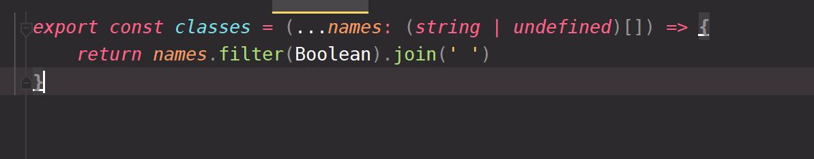
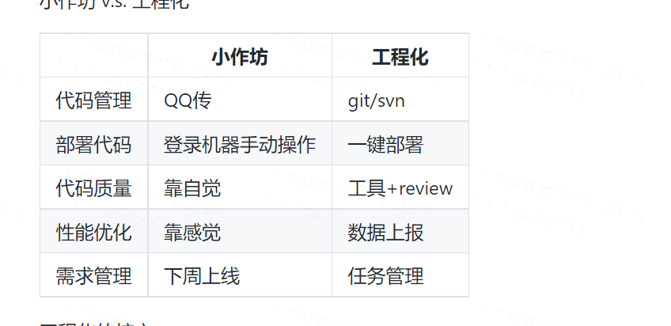

1. 创建一个远程仓库
2. npm 初始化 (yarn init -y) 每次修改代码必须提交
3. 安装webpack

umd是什么？ 一开始没有包管理，一切都是scrpit  
然后出现了require.js 发明了一个标准叫做 amd  
async module defined 异步的模块定义  
然后node的社区出现了他的定义 module.exports   
然后出现了统一的 - umd

配置ts 首先写一个文件 tsconfig.json   
snapshot来测试，用眼睛来测试

加不加 --dev

1. 是否只给程序员用? react 不能加 --dev webpack 加 --dev jQuery 不能加 --dev ts 加 --dev
2. 什么都不加 就是--save
3. --save -S --dev -D
4. yarn --save不需要 npm --save-dev = -D

webpack-dev-server用来做什么  
开一个server,默认监听8080端口 将文件放在内存内，这样做会很快

package.json script写命令：
```json
{
  "scripts" : {
    "start": "webpack-dev-server",
    "build": "webpack"
  }
}
```  

在ts中，需要单独安装react的声明文件  

yarn.lock 是干什么的？
yarn的lock文件，这是一个锁，写了该版本下对应的兼容的版本号   

相对路径和绝对路径  
如果是自己的库，那么我们用相对路径，如果是第三方库，那么我们用绝对路径  

'React' refers to a UMD global, but the current file is a module. Consider adding an import instead.
为什么会报这个错？因为tsx的本质就是React.createElement....  

总是报错找不到某个文件？ webpack resolve extends > [] 加入就好了  

webpack-dev-server 报错 WARNING in asset size limit: The following asset(s) exceed the recommended size limit (244 KiB):
产生的文件太大了,为什么？ 因为在生产者模式下，它把react也打包进去了
```js
module.exports = {
    performance: {
        hints: false,
        maxAssetSize: 200000,
        maxEntrypointSize: 400000,
        assetFilter: (assetFilename)=>{
            return assetFilename.endsWith('.css') || assetFilename.endsWith('.js')
        }
    },
}
```
由此知道，Mode的用处，我们也可以改成mode:"development"  

如何将依赖变小：1.mode改成"production"2.写React的依赖，代码如下
```js
module.exports = {
    externals: {
        react: {
            commonjs: 'react',
            commonjs2: 'react',
            amd: 'react',
            root: 'React',
        },
        'react-dom': {
            commonjs: 'react-dom',
            commonjs2: 'react-dom',
            amd: 'react-dom',
            root: 'ReactDOM',
        },
    }
}
```

cross-env 是干啥的？  
【这是用来做不同环境中配置环境变量的。 ？？？   

* as react 为什么要写成这样才行？  

jslint jshint 
jscs - js code style   
standardJs  不好用  
不要重复造轮子 使用者角度来说 
开发者 antd iview 等等，发现了bug,被牵着鼻子走  
公司一般不用别的公司的轮子 react 框架 facebook license google 使用 angular   
vue 也可以用 没有商业公司 中国大公司为啥不开发自己的框架呢？
react native vuex 
不流于平庸 造轮子会产生各种技术层面的问题  在ui中会使用到的算法 过去一年内用过什么算法 所有的知识都是在调用api 创造  
不为钱写代码 每周至少两个小时 不为钱写代码 证明自驱动能力 郭家宝  
ui轮子而不是其他轮子 轮子风口 写到简历里面马上能涨工资的 框架什么的市场已经定型了，没有必要  
ui框架 每个公司都需要ui框架 ~ 什么是造轮子，为什么是ui轮子  
这些东西没有书，也没有这么具体的教 没有什么书会教你   

手机上的ui框架不好用 功能不符合要求或者很久没有更新了 手机上实际上交互很少 交互多的很少会去上网页  
手机上 下拉更新 顶级问题 最常用的  

正式开始造轮子   

猜测类型  此时e.target的值要么是SVGUseElement要么是SVGElemnt  
as 把某个东西当做xxx类来处理  

`<div {...props}></div>` 这个是React中语法的花括号  

将class单独提取出来解决   
测不出来原因  import * as react 没有这么写，而是直接写了React from 'react',此时解析tsx的时候发现找不到react对应的文件  

什么是工程化?  
  

代码质量？ 同事写的代码很垃圾，也不好改 时间一长就是各种Bug，代码质量靠自觉  
靠工具 + review  
性能优化靠感觉 数据上报  
下周上线 任务管理  

  
测试覆盖
- stmts 语句覆盖率
- brand 分支覆盖率 
- funcs 函数覆盖率
- lines 代码行数覆盖率  

用自动化的服务进行测试命令  

什么是ci?   

什么是state变了？
class this.setState -> {...state}  
shouldComponentUpdate 钩子优化state  PureComponent 纯组件 但是如果改state呢，造成不会改变 -> 修改state非常危险
function [state,setState] state的引用变了没有 
immer.js > 了解一下 复制的方式很智能，不是深拷贝 懒拷贝  
  
Class组件和函数组件 should 

老前端不要用class,新人不听劝 不要反着做 建议用function  

react全局组件如何处理 -> window.xxxx 然后写在xxxx上
init.js 所有应用执行之前先去执行 import不管写多少遍，明显没有bug

不可变数据 可回溯 撤销 time travel